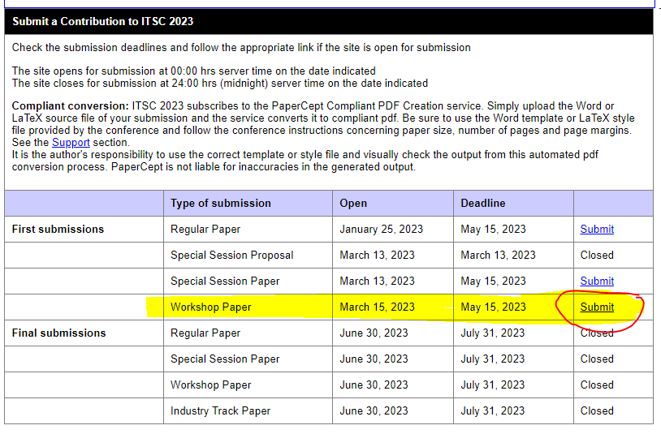
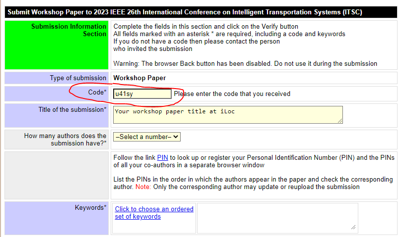

{} Call for workshop papers are closed now. {}

{} [Download our CFP (PDF)>>](https://iloc-2023.netlify.app/uploads/iLoc2023-poster.pdf) {}



## Scope of the Workshop

This workshop aims to address the localization integrity requirements of automated vehicles. The concept of integrity is defined as “a measure of trust which can be placed in the correctness of the information supplied by the total system”. In particular, it is a critical performance indicator for the navigation of highly automated vehicles (e.g., SAE L3 and above). To guarantee the safe driving of an AV in varying environments, measures of the localization information gathered from different sensors, such as LiDAR, IMU and GNSS, are required. Continuously and reliably estimating a vehicle’s position in varying driving environments is essential for autonomous driving and safe operation. However, dynamic and complex traffic environments make high-integrity localization very challenging in the vehicular domain. In our 2nd iLoc workshop, we want to emphasize the importance of integrity in ITS and address the scientific challenges in managing localization integrity for vehicle navigation in complex traffic environments, including its use as part of perception tasks.

## Topics of Interest

At this workshop, the research topics of interest include but are not limited to:

* What are the leading factors for high-integrity localization for AVs?
* Which multi-sensor architectures and data fusion methods are best suited for autonomous driving?
* How to estimate the uncertainty and integrity risks applicable to model-based and data-driven approaches to localization?
* How can maps be used to increase localization integrity?
* How to combine a vehicle kinematic model and road geometry to improve integrity estimation?
* What are the integrity metrics needs for AVs?
* Are there any emergent standards applicable to the estimation of integrity in ITS?
* How to verify experimentally the system localization integrity when considering low risks?
* Uncertainty estimation of LiDAR point clouds registration and imagery data processing in e.g., probabilistic and deep learning-based models
* State-of-the-art deep learning multi-modal data fusion for e.g., GNSS, LiDAR point clouds, images, 3D map localization information with integrity estimation.

## Workshop Sessions

The workshop is organized over a full day divided into four sessions (two in the morning and two in the afternoon). Each session contains at least one invited speaker and one workshop paper. A poster session is also planned between the morning and afternoon sessions to facilitate discussions among participants.

### Invited Talks

The list of our invited speakers is constantly updated. Check out the up-to-date list: [\>>](/speaker)
***
### Paper Presentations
All submitted workshop papers will follow the **peer review process** of ITSC.

Accepted workshop papers will be included in the **IEEE-ITSC 2023 conference proceedings**.

Accepted workshop papers will be offered a time slot for oral presentation at the workshop. 

***
### Poster Session

In addition to oral presentations, a poster session is planned between the morning and afternoon sessions to facilitate discussions among participants. All poster presenters will be provided **physical poster boards**, but they are responsible for their own printing work. Workshop paper authors are encouraged to participate in the poster session.

More information on the poster session will be made available soon.

## Paper Submission Guidelines
Paper Submission Timelines

* Paper submission deadline: ~~May 15, 2023~~ ~~May 22, 2023~~ May 28, 2023
* Decision notification: June 30, 2023
* Final paper submission: July 31, 2023
* Workshop session: September 24, 2023

***
To submit your workshop paper, please use the[ PaperCept platform](https://its.papercept.net/conferences/scripts/start.pl) by IEEE-ITSC 2023

***
To contribute to our workshop, you should indicate our ***Workshop Code*** in your submission: 

> ***u41sy***

***
To submit a manuscript via papercept, you must have the following items readily available:

* Title of the manuscript.
* Short 200 words text-only abstract of the manuscript.
* PINs of "ALL" co-authors (you can locate your co-authors' PIN by following PIN link from its.papercept.net)
* Authors names and affiliations (the review process is not double blinded).
* You will have a chance to update all this information at the time of final submission.
* Keywords, you will be prompted for 1-3 conference specific keywords during the initial submission process.
* Manuscript file: this should be one of the following

  * A PDF file (version 1.4 or higher), have all fonts embedded/subsetted, in U.S. letter page size, searchable, non-password protected document.
  * A single Word file based on template provided through [ieeeconf_letter.dot](http://its.papercept.net/conferences/support/word.php) and sample document [ieeeconf_letter.doc](http://its.papercept.net/conferences/support/word.php).
  * A single zipped file containing all LaTeX sources, images, style/cls files including the ieeeconf.cls, bib files, with the main tex file called root.tex (documentclass must be a4paper). LaTeX style file [ieeeconf.cls](https://its.papercept.net/conferences/templates/ieeeconf.cls) and sample document [sample_new.tex](https://its.papercept.net/conferences/templates/sample_new.tex) (both on [ieeeconf.zip](http://its.papercept.net/conferences/support/tex.php)), BiBTeX files [IEEEtranBST.zip](http://its.papercept.net/conferences/support/tex.php).

***
Compliant conversion: 
* ITSC 2023 subscribes to the PaperCept Compliant PDF Creation service. Simply upload the Word or LaTeX source file of your submission and the service converts it to compliant pdf. Be sure to use the Word template or LaTeX style file provided by the conference and follow the conference instructions concerning paper size, number of pages and page margins. See the [Support section at PaperCept](http://its.papercept.net/conferences/support).
* It is the author's responsibility to use the correct template or style file and visually check the output from this automated pdf conversion process. PaperCept is not liable for inaccuracies in the generated output.

***
Page limit:

* For the first submission, a manuscript in letter format can be of **6-8 pages**. 
* For the final submission, a manuscript should be in letter format of 6 pages, with 2 additional pages allowed but at an extra charge.

## Poster Session Guidelines
## Poster Presentation Guidelines
We are pleased to open a call for poster presentations in this workshop.

The call is open to present novel, past or ongoing research related to the topics covered by the workshop.

Authors that will present a related paper at the ITSC'23 conference are also more than welcome to present a poster in this workshop.

Practical information:
* Information to provide: a proposal should contain **the name and affiliation of the authors, a title, and an abstract**
* Submission: the proposal needs to be sent to Dr. Philippe Xu (philippe.xu@hds.utc.fr)
* Submission deadline: August 15, 2023
* Notification of acceptance: August 16, 2023

Please note:
* Posters are printed and brought by authors to the conference venue. Information about local companies capable of printing posters can be provided by the ITSC'23 conference organizers on demand (itsc2023@tisasa.es),
* The poster presentation will not be peer-reviewed nor included in the ITSC conference proceedings,
* Poster size recommendations by ITSC'23 conference: _Panels allow for poster sizes of max. 95 cm (width) x 191 cm (height), with a vertical orientation. Standard A0 (841 x 1189 mm) is highly recommended._ ([> ITSC'23 paper presentation guidelines](https://2023.ieee-itsc.org/paper-presentation/))
* Please contact Philippe Xu (philippe.xu@hds.utc.fr) in case of any questions.

> Please stay tuned for more information.
