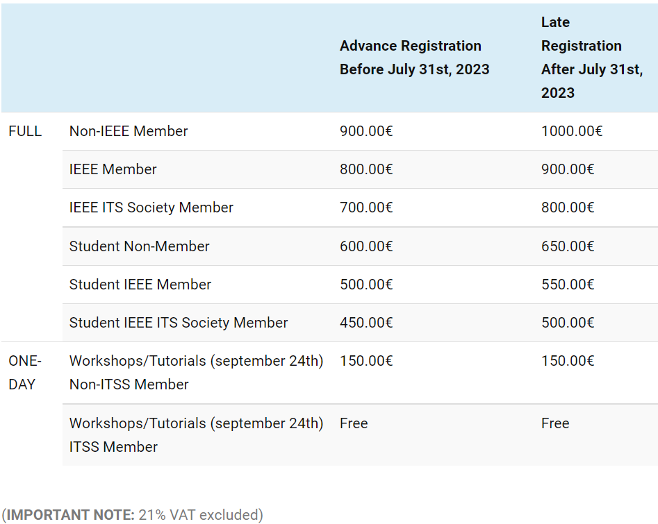

{} Fees for the different participation modalities are now available on the ITSC website. The registration portal will be open soon. Please stay tuned for updates! [Check out the ITSC announcement>>](https://2023.ieee-itsc.org/registration/) {}



### General instructions to be considered for the registration:

- All fees are indicated in Euros (€), 21% VAT excluded.
- All registration modes labeled as **FULL** include access to all the technical sessions of the conference, including tutorials and workshops.
- Registration modes labeled as **ONE-DAY only** includes access to the **workshops and tutorials** (to be held on September 24th, 2023).
- Each FULL registration includes one ticket to the gala dinner (September 26th, 2023). Extra tickets for the gala dinner can be purchased (100 €/person).
- The conference registration portal (available soon) accepts payments made with VISA, VISA Electron, Mastercard, Maestro, JCB, V-Pay and Union Pay.

### Author instructions:

- Each accepted paper (no matter if it will be presented at a regular, special session or workshop) requires at least one **full non-student** registration for uploading the paper and having it included in the conference proceedings. 
- A full non-student registration covers only **one** accepted paper.
- Additional papers by the same author can be covered by the same full non-student registration, at a flat rate of 500.00 € / additional paper.
- Additional pages to the 6-page limit imposed for all papers require **an extra fee of 100 € per additional page** (up to a total maximum of **8 pages** per paper, i.e. only **2 extra pages** are allowed).  

### Invited speaker instructions:

- There are no fees for invited speakers to the workshops, but they will not be allowed to attend the rest of the conference unless a FULL registration is purchased.

### Registration fees

### Refund Policy
Please refer to the ITSC website [>>](https://2023.ieee-itsc.org/registration/)

